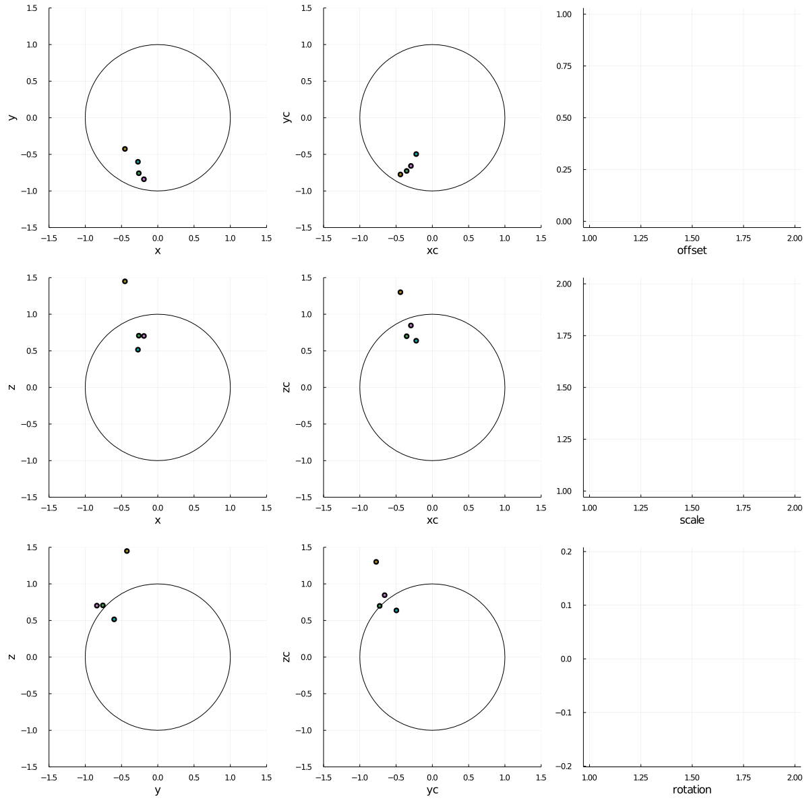

# AccelerometerCalibration.jl

Uses [Optim.jl](https://github.com/JuliaNLSolvers/Optim.jl) to fit calibration parameters (offset, scale, rotation) to a stream of accelerometer data.

## Examples

Single channel:

```julia
cal = Calibration()
for s in sensor.get_samples()
    update_calibration!(cal, s)
    push!(calibrated_samples, cal * s)
end
```

Multiple channels (assumed to be fixed together and moved in unison for calibration):

```julia
calv = [Calibration() for i in 1:4]
while true
    sv = [sensor1.get_sample(),
          sensor2.get_sample(),
          sensor3.get_sample(),
          sensor4.get_sample()]
    update_calibration!(calv, vs)
    push!(calibrated_samples, [cal * s for s in sv])
end
```



